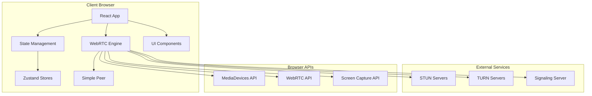
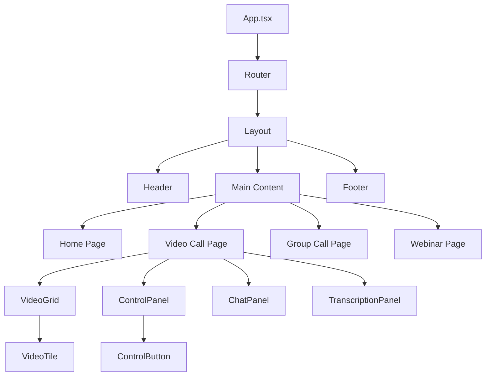
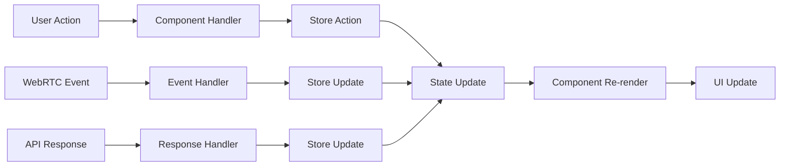
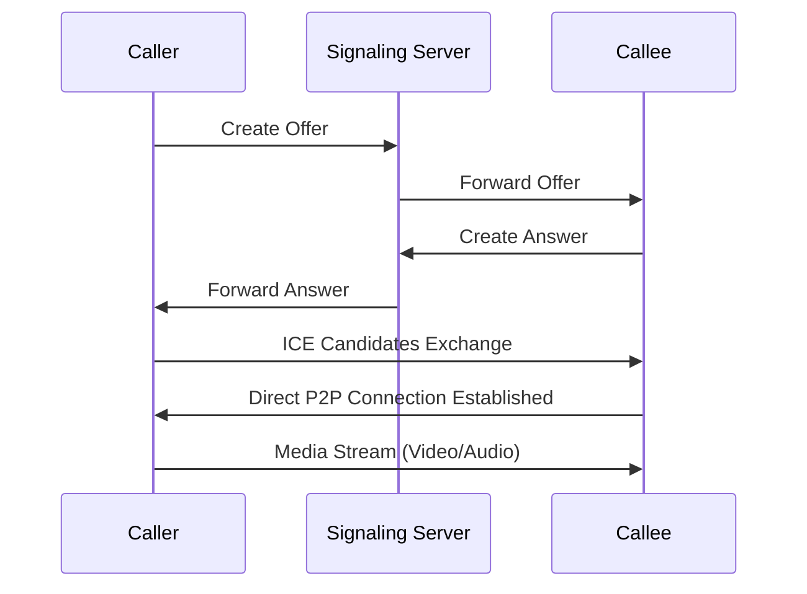

# Architecture Guide

This document provides a comprehensive overview of the Stream video communication platform's architecture, design patterns, and technical implementation.

## 🏗️ System Architecture Overview

Stream is built as a modern single-page application (SPA) with a peer-to-peer architecture for real-time communication.

### High-Level Architecture



## 🎯 Core Architecture Principles

### 1. **Peer-to-Peer First**
- Direct browser-to-browser communication using WebRTC
- Minimal server dependency for better privacy and performance
- Fallback to relay servers (TURN) when direct connection fails

### 2. **Component-Based Design**
- Modular, reusable React components
- Clear separation of concerns
- Composable UI architecture

### 3. **State-First Architecture**
- Centralized state management with Zustand
- Predictable state updates and side effects
- Persistent state for user preferences

### 4. **Performance Optimized**
- Code splitting and lazy loading
- Optimized bundle sizes
- Efficient re-rendering strategies

## 📦 Application Structure

### Frontend Architecture

```
Stream/
├── public/                 # Static assets
├── src/
│   ├── components/         # React components
│   │   ├── ui/            # Basic UI components
│   │   ├── features/      # Feature-specific components
│   │   └── layout/        # Layout components
│   ├── pages/             # Route components
│   ├── hooks/             # Custom React hooks
│   ├── store/             # State management
│   ├── utils/             # Helper functions
│   ├── types/             # TypeScript definitions
│   ├── constants/         # Application constants
│   └── styles/            # Global styles
├── docs/                  # Documentation
└── config/                # Configuration files
```

### Component Hierarchy



## 🔄 Data Flow Architecture

### State Management Pattern

Stream uses **Zustand** for state management with a domain-driven approach:

```typescript
// Domain-specific stores
useVideoStore      // Video call state and controls
useAuthStore       // Authentication and user data
useUIStore         // UI state and preferences
useSchedulerStore  // Meeting scheduling
useDocumentStore   // Collaborative documents
```

### Data Flow Diagram



## 🎥 WebRTC Architecture

### Connection Flow



### Media Pipeline

```typescript
// Media processing pipeline
getUserMedia() → 
MediaStreamTrack → 
RTCPeerConnection → 
Remote MediaStream → 
Video Element
```

### WebRTC Components

1. **Peer Connection Manager**
   ```typescript
   class PeerConnectionManager {
     private peerConnection: RTCPeerConnection;
     private localStream: MediaStream;
     private remoteStreams: Map<string, MediaStream>;
     
     async createConnection(config: RTCConfiguration): Promise<void>;
     async addLocalStream(stream: MediaStream): Promise<void>;
     async createOffer(): Promise<RTCSessionDescription>;
     async handleAnswer(answer: RTCSessionDescription): Promise<void>;
   }
   ```

2. **Media Manager**
   ```typescript
   class MediaManager {
     async getUserMedia(constraints: MediaStreamConstraints): Promise<MediaStream>;
     async getDisplayMedia(constraints?: DisplayMediaStreamConstraints): Promise<MediaStream>;
     stopStream(stream: MediaStream): void;
     switchCamera(deviceId: string): Promise<MediaStream>;
   }
   ```

3. **Signaling Manager**
   ```typescript
   class SignalingManager {
     private socket: WebSocket;
     
     connect(url: string): void;
     sendOffer(offer: RTCSessionDescription, targetId: string): void;
     sendAnswer(answer: RTCSessionDescription, targetId: string): void;
     sendIceCandidate(candidate: RTCIceCandidate, targetId: string): void;
   }
   ```

## 🧩 Component Architecture

### Component Design Patterns

#### 1. **Container/Presentational Pattern**

```typescript
// Container Component (handles logic)
const VideoCallContainer: React.FC = () => {
  const { participants, isConnected, connect, disconnect } = useVideoCall();
  const { isAudioEnabled, isVideoEnabled, toggleAudio, toggleVideo } = useVideoStore();
  
  return (
    <VideoCallPresentation
      participants={participants}
      isConnected={isConnected}
      isAudioEnabled={isAudioEnabled}
      isVideoEnabled={isVideoEnabled}
      onConnect={connect}
      onDisconnect={disconnect}
      onToggleAudio={toggleAudio}
      onToggleVideo={toggleVideo}
    />
  );
};

// Presentational Component (handles rendering)
interface VideoCallPresentationProps {
  participants: Participant[];
  isConnected: boolean;
  isAudioEnabled: boolean;
  isVideoEnabled: boolean;
  onConnect: () => void;
  onDisconnect: () => void;
  onToggleAudio: () => void;
  onToggleVideo: () => void;
}

const VideoCallPresentation: React.FC<VideoCallPresentationProps> = ({
  participants,
  isConnected,
  isAudioEnabled,
  isVideoEnabled,
  onConnect,
  onDisconnect,
  onToggleAudio,
  onToggleVideo
}) => {
  return (
    <div className="video-call">
      <VideoGrid participants={participants} />
      <ControlPanel
        isAudioEnabled={isAudioEnabled}
        isVideoEnabled={isVideoEnabled}
        onToggleAudio={onToggleAudio}
        onToggleVideo={onToggleVideo}
      />
    </div>
  );
};
```

#### 2. **Compound Component Pattern**

```typescript
// Main component
const VideoGrid: React.FC<VideoGridProps> = ({ participants, layout }) => {
  return (
    <div className={`video-grid video-grid--${layout}`}>
      {participants.map(participant => (
        <VideoGrid.Tile key={participant.id} participant={participant}>
          <VideoGrid.Video stream={participant.stream} />
          <VideoGrid.Controls participant={participant} />
          <VideoGrid.Label name={participant.name} />
        </VideoGrid.Tile>
      ))}
    </div>
  );
};

// Sub-components
VideoGrid.Tile = ({ children, participant }) => (
  <div className="video-tile" data-participant={participant.id}>
    {children}
  </div>
);

VideoGrid.Video = ({ stream }) => {
  const videoRef = useRef<HTMLVideoElement>(null);
  
  useEffect(() => {
    if (videoRef.current && stream) {
      videoRef.current.srcObject = stream;
    }
  }, [stream]);
  
  return <video ref={videoRef} autoPlay muted />;
};

VideoGrid.Controls = ({ participant }) => (
  <div className="video-controls">
    <MuteButton participant={participant} />
    <VideoButton participant={participant} />
  </div>
);

VideoGrid.Label = ({ name }) => (
  <div className="video-label">{name}</div>
);
```

#### 3. **Higher-Order Component Pattern**

```typescript
// HOC for authentication
function withAuth<T extends object>(
  WrappedComponent: React.ComponentType<T>
): React.ComponentType<T> {
  return (props: T) => {
    const { isAuthenticated, user } = useAuthStore();
    
    if (!isAuthenticated) {
      return <LoginPage />;
    }
    
    return <WrappedComponent {...props} user={user} />;
  };
}

// Usage
const ProtectedVideoCall = withAuth(VideoCall);
```

#### 4. **Custom Hooks Pattern**

```typescript
// Custom hook for video call functionality
export const useVideoCall = (roomId: string) => {
  const [participants, setParticipants] = useState<Participant[]>([]);
  const [isConnected, setIsConnected] = useState(false);
  const peerConnectionRef = useRef<RTCPeerConnection | null>(null);
  
  const connect = useCallback(async () => {
    try {
      const localStream = await navigator.mediaDevices.getUserMedia({
        video: true,
        audio: true
      });
      
      const peerConnection = new RTCPeerConnection(RTC_CONFIG);
      peerConnectionRef.current = peerConnection;
      
      localStream.getTracks().forEach(track => {
        peerConnection.addTrack(track, localStream);
      });
      
      peerConnection.ontrack = (event) => {
        const [remoteStream] = event.streams;
        // Handle remote stream
      };
      
      setIsConnected(true);
    } catch (error) {
      console.error('Failed to connect:', error);
    }
  }, [roomId]);
  
  const disconnect = useCallback(() => {
    if (peerConnectionRef.current) {
      peerConnectionRef.current.close();
      peerConnectionRef.current = null;
    }
    setIsConnected(false);
    setParticipants([]);
  }, []);
  
  useEffect(() => {
    return () => {
      disconnect();
    };
  }, [disconnect]);
  
  return {
    participants,
    isConnected,
    connect,
    disconnect
  };
};
```

## 📊 State Management Architecture

### Zustand Store Pattern

```typescript
// Base store interface
interface BaseStore {
  // State
  [key: string]: any;
  
  // Actions
  reset: () => void;
}

// Store creator with common patterns
const createStore = <T extends BaseStore>(
  name: string,
  initialState: Partial<T>,
  actions: (set: any, get: any) => Partial<T>
) => {
  return create<T>()(
    devtools(
      persist(
        (set, get) => ({
          ...initialState,
          ...actions(set, get),
          reset: () => set(initialState)
        }),
        {
          name: `stream-${name}`,
          partialize: (state) => {
            // Only persist certain keys
            const { reset, ...persistedState } = state;
            return persistedState;
          }
        }
      ),
      { name: `Stream ${name}` }
    )
  );
};

// Video store implementation
interface VideoStoreState extends BaseStore {
  // State
  localStream: MediaStream | null;
  remoteStreams: Map<string, MediaStream>;
  participants: Participant[];
  isVideoEnabled: boolean;
  isAudioEnabled: boolean;
  currentRoom: string | null;
  
  // Actions
  setLocalStream: (stream: MediaStream | null) => void;
  addRemoteStream: (participantId: string, stream: MediaStream) => void;
  removeRemoteStream: (participantId: string) => void;
  toggleVideo: () => void;
  toggleAudio: () => void;
  joinRoom: (roomId: string) => Promise<void>;
  leaveRoom: () => void;
}

export const useVideoStore = createStore<VideoStoreState>(
  'video',
  {
    localStream: null,
    remoteStreams: new Map(),
    participants: [],
    isVideoEnabled: false,
    isAudioEnabled: false,
    currentRoom: null
  },
  (set, get) => ({
    setLocalStream: (stream) => set({ localStream: stream }),
    
    addRemoteStream: (participantId, stream) => {
      const { remoteStreams } = get();
      const newStreams = new Map(remoteStreams);
      newStreams.set(participantId, stream);
      set({ remoteStreams: newStreams });
    },
    
    removeRemoteStream: (participantId) => {
      const { remoteStreams } = get();
      const newStreams = new Map(remoteStreams);
      newStreams.delete(participantId);
      set({ remoteStreams: newStreams });
    },
    
    toggleVideo: () => {
      const { isVideoEnabled, localStream } = get();
      const videoTrack = localStream?.getVideoTracks()[0];
      
      if (videoTrack) {
        videoTrack.enabled = !isVideoEnabled;
        set({ isVideoEnabled: !isVideoEnabled });
      }
    },
    
    toggleAudio: () => {
      const { isAudioEnabled, localStream } = get();
      const audioTrack = localStream?.getAudioTracks()[0];
      
      if (audioTrack) {
        audioTrack.enabled = !isAudioEnabled;
        set({ isAudioEnabled: !isAudioEnabled });
      }
    },
    
    joinRoom: async (roomId) => {
      try {
        // Implementation for joining room
        set({ currentRoom: roomId });
      } catch (error) {
        console.error('Failed to join room:', error);
      }
    },
    
    leaveRoom: () => {
      const { localStream, remoteStreams } = get();
      
      // Cleanup streams
      localStream?.getTracks().forEach(track => track.stop());
      remoteStreams.forEach(stream => {
        stream.getTracks().forEach(track => track.stop());
      });
      
      set({
        localStream: null,
        remoteStreams: new Map(),
        participants: [],
        currentRoom: null,
        isVideoEnabled: false,
        isAudioEnabled: false
      });
    }
  })
);
```

## 🎨 UI Architecture

### Design System Structure

```typescript
// Theme configuration
export const theme = {
  colors: {
    primary: {
      50: '#eff6ff',
      500: '#3b82f6',
      600: '#2563eb',
      700: '#1d4ed8',
    },
    gray: {
      50: '#f9fafb',
      500: '#6b7280',
      800: '#1f2937',
      900: '#111827',
    }
  },
  spacing: {
    xs: '0.25rem',
    sm: '0.5rem',
    md: '1rem',
    lg: '1.5rem',
    xl: '2rem',
  },
  typography: {
    fontFamily: {
      sans: ['Inter', 'system-ui', 'sans-serif'],
    },
    fontSize: {
      sm: '0.875rem',
      base: '1rem',
      lg: '1.125rem',
      xl: '1.25rem',
    }
  }
};

// Component variants
export const buttonVariants = {
  primary: 'bg-blue-600 text-white hover:bg-blue-700',
  secondary: 'bg-gray-200 text-gray-800 hover:bg-gray-300',
  danger: 'bg-red-600 text-white hover:bg-red-700',
};

export const inputVariants = {
  default: 'border border-gray-300 rounded-md px-3 py-2 focus:ring-2 focus:ring-blue-500',
  error: 'border border-red-300 rounded-md px-3 py-2 focus:ring-2 focus:ring-red-500',
};
```

### Responsive Design Architecture

```typescript
// Breakpoint system
export const breakpoints = {
  sm: '640px',
  md: '768px',
  lg: '1024px',
  xl: '1280px',
  '2xl': '1536px'
};

// Responsive utilities
export const useResponsive = () => {
  const [screenSize, setScreenSize] = useState<'sm' | 'md' | 'lg' | 'xl'>('lg');
  
  useEffect(() => {
    const updateScreenSize = () => {
      const width = window.innerWidth;
      if (width < 640) setScreenSize('sm');
      else if (width < 768) setScreenSize('md');
      else if (width < 1024) setScreenSize('lg');
      else setScreenSize('xl');
    };
    
    updateScreenSize();
    window.addEventListener('resize', updateScreenSize);
    return () => window.removeEventListener('resize', updateScreenSize);
  }, []);
  
  return {
    screenSize,
    isMobile: screenSize === 'sm',
    isTablet: screenSize === 'md',
    isDesktop: ['lg', 'xl'].includes(screenSize),
  };
};

// Layout components with responsive behavior
export const VideoGrid: React.FC<VideoGridProps> = ({ participants }) => {
  const { isMobile, isTablet } = useResponsive();
  
  const getGridLayout = () => {
    if (isMobile) return 'grid-cols-1';
    if (isTablet) return 'grid-cols-2';
    if (participants.length <= 4) return 'grid-cols-2';
    if (participants.length <= 9) return 'grid-cols-3';
    return 'grid-cols-4';
  };
  
  return (
    <div className={`grid gap-2 ${getGridLayout()}`}>
      {participants.map(participant => (
        <VideoTile key={participant.id} participant={participant} />
      ))}
    </div>
  );
};
```

## 🔌 Integration Architecture

### WebRTC Integration

```typescript
// WebRTC service layer
export class WebRTCService {
  private peerConnections: Map<string, RTCPeerConnection> = new Map();
  private localStream: MediaStream | null = null;
  
  async initialize(constraints: MediaStreamConstraints): Promise<void> {
    this.localStream = await navigator.mediaDevices.getUserMedia(constraints);
  }
  
  async createPeerConnection(participantId: string): Promise<RTCPeerConnection> {
    const peerConnection = new RTCPeerConnection({
      iceServers: [
        { urls: 'stun:stun.l.google.com:19302' },
        // Add TURN servers for production
      ],
    });
    
    // Add local stream tracks
    if (this.localStream) {
      this.localStream.getTracks().forEach(track => {
        peerConnection.addTrack(track, this.localStream!);
      });
    }
    
    // Handle remote stream
    peerConnection.ontrack = (event) => {
      const [remoteStream] = event.streams;
      this.handleRemoteStream(participantId, remoteStream);
    };
    
    // Handle ICE candidates
    peerConnection.onicecandidate = (event) => {
      if (event.candidate) {
        this.sendICECandidate(participantId, event.candidate);
      }
    };
    
    this.peerConnections.set(participantId, peerConnection);
    return peerConnection;
  }
  
  private handleRemoteStream(participantId: string, stream: MediaStream): void {
    // Update store with remote stream
    useVideoStore.getState().addRemoteStream(participantId, stream);
  }
  
  private sendICECandidate(participantId: string, candidate: RTCIceCandidate): void {
    // Send via signaling server
    signalingService.sendICECandidate(participantId, candidate);
  }
  
  async cleanup(): Promise<void> {
    // Stop local stream
    this.localStream?.getTracks().forEach(track => track.stop());
    this.localStream = null;
    
    // Close peer connections
    this.peerConnections.forEach(pc => pc.close());
    this.peerConnections.clear();
  }
}
```

### API Integration

```typescript
// API service layer
export class APIService {
  private baseURL = import.meta.env.VITE_API_BASE_URL || '';
  
  private async request<T>(
    endpoint: string,
    options: RequestInit = {}
  ): Promise<T> {
    const url = `${this.baseURL}${endpoint}`;
    const response = await fetch(url, {
      headers: {
        'Content-Type': 'application/json',
        ...options.headers,
      },
      ...options,
    });
    
    if (!response.ok) {
      throw new Error(`HTTP error! status: ${response.status}`);
    }
    
    return response.json();
  }
  
  // Meeting API
  async createMeeting(meeting: CreateMeetingRequest): Promise<Meeting> {
    return this.request<Meeting>('/meetings', {
      method: 'POST',
      body: JSON.stringify(meeting),
    });
  }
  
  async getMeeting(meetingId: string): Promise<Meeting> {
    return this.request<Meeting>(`/meetings/${meetingId}`);
  }
  
  // User API
  async getCurrentUser(): Promise<User> {
    const token = localStorage.getItem('auth_token');
    return this.request<User>('/user/me', {
      headers: {
        Authorization: `Bearer ${token}`,
      },
    });
  }
}
```

## 📈 Performance Architecture

### Bundle Optimization

```typescript
// Vite configuration for optimal bundling
export default defineConfig({
  build: {
    rollupOptions: {
      output: {
        manualChunks: {
          // Vendor libraries
          vendor: ['react', 'react-dom'],
          router: ['react-router-dom'],
          state: ['zustand'],
          
          // Feature chunks
          webrtc: ['simple-peer'],
          ui: ['framer-motion', 'lucide-react'],
          utils: ['date-fns', 'lodash-es'],
        },
      },
    },
    
    // Optimize chunks
    chunkSizeWarningLimit: 1000,
    
    // Enable source maps for debugging
    sourcemap: true,
  },
  
  // Optimize dependencies
  optimizeDeps: {
    include: [
      'react',
      'react-dom',
      'react-router-dom',
      'zustand',
      'simple-peer',
    ],
    exclude: ['@vite/client', '@vite/env'],
  },
});
```

### Memory Management

```typescript
// Memory-efficient component patterns
export const VideoTile: React.FC<VideoTileProps> = ({ participant }) => {
  const videoRef = useRef<HTMLVideoElement>(null);
  const streamRef = useRef<MediaStream | null>(null);
  
  useEffect(() => {
    if (videoRef.current && participant.stream) {
      streamRef.current = participant.stream;
      videoRef.current.srcObject = participant.stream;
    }
    
    // Cleanup function
    return () => {
      if (videoRef.current) {
        videoRef.current.srcObject = null;
      }
      if (streamRef.current) {
        streamRef.current.getTracks().forEach(track => track.stop());
        streamRef.current = null;
      }
    };
  }, [participant.stream]);
  
  return (
    <div className="video-tile">
      <video
        ref={videoRef}
        autoPlay
        playsInline
        muted={participant.id === 'local'}
      />
    </div>
  );
};
```

---

This architecture guide provides a comprehensive overview of Stream's technical implementation. The modular, scalable design ensures maintainability and extensibility as the platform grows.